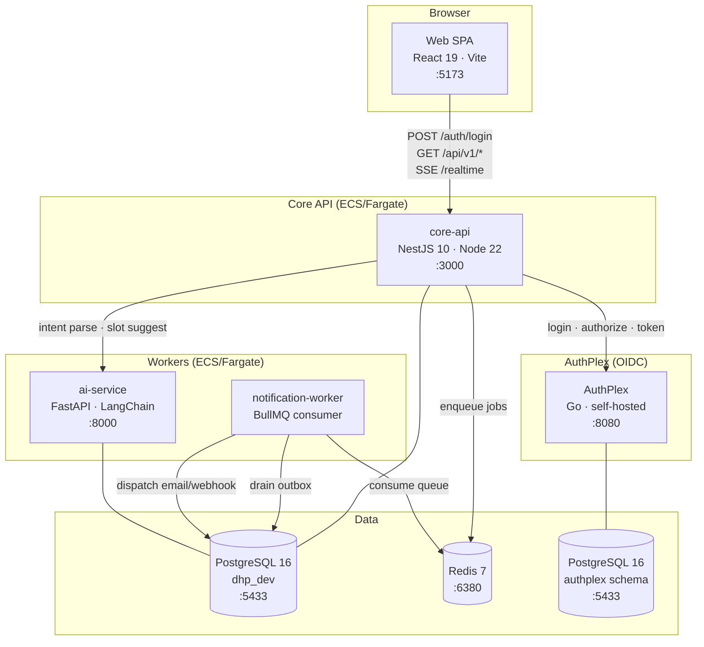
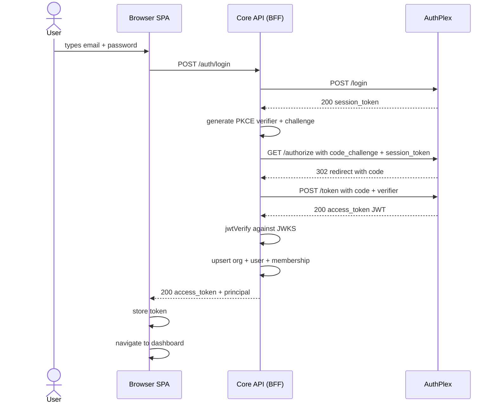
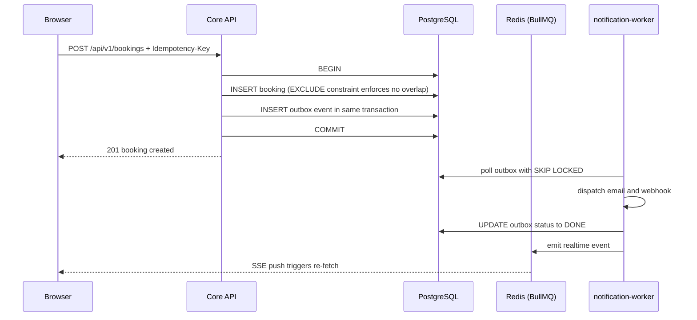
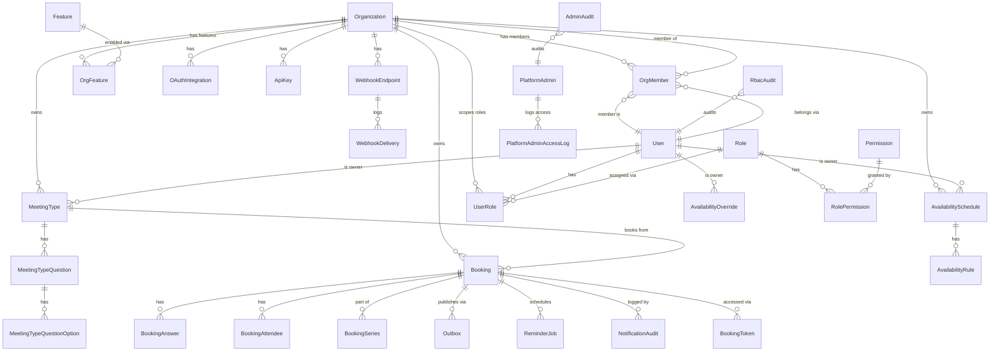

# Architecture

## System Topology



### Web SPA (React 19 + Vite, port 5173)

The browser-side single-page application. It is a pure client — it holds no business logic and enforces no security. Every state change that matters (creating a booking, updating a meeting type) is a server call. Real-time updates arrive via Server-Sent Events from the Core API; the SPA reacts by invalidating its TanStack Query cache and re-fetching rather than applying event payloads directly. This keeps client state eventually-consistent without a complex merge algorithm.

The SPA communicates only with the Core API. It never contacts AuthPlex, the AI service, or any other backend directly. Auth tokens are kept in memory (not localStorage) so they expire naturally when the tab closes.

### Core API (NestJS 10 + Node.js 22, port 3000)

The system of record. All writes, reads, and business-rule enforcement go through here. It owns the PostgreSQL schema via Prisma and is the only process that writes to the application tables.

It is built with Fastify (not Express) for lower latency and better throughput under load. NestJS provides the DI container and module system; Fastify handles the actual HTTP layer. The API exposes a live OpenAPI spec at `/api/docs` (Swagger UI) and `/api/docs-json` (raw JSON) — this is the authoritative contract between the SPA and the API.

The Core API also acts as the BFF (Backend-for-Frontend) for authentication. The browser posts credentials here; the API performs the full OIDC server-side flow with AuthPlex and returns an access token. The browser never contacts AuthPlex.

### Notification Worker (Node.js + BullMQ)

A background process with no HTTP server. It polls the `outbox` table in Postgres for pending events produced by the Core API and dispatches the corresponding side effects: confirmation emails, guest reminder emails, webhook deliveries to registered endpoints. It uses `SELECT ... FOR UPDATE SKIP LOCKED` so multiple worker instances can run safely without double-processing.

The worker is decoupled from the Core API by the transactional outbox pattern — the Core API writes an outbox record in the same database transaction as the state change, guaranteeing the event is never lost even if the worker is down.

### AI Service (FastAPI + LangChain, port 8000)

A Python microservice that wraps LLM calls. The Core API calls it when a guest submits a natural-language scheduling request (e.g., "I'd like 30 minutes sometime Thursday afternoon"). The AI service parses the intent into a structured `SchedulingIntent` object and suggests concrete time slots based on the host's availability. It also stores embedding vectors in pgvector for intent retrieval and analytics.

It is isolated from the browser. The Core API authenticates calls to it with a short-lived HMAC service token (`SERVICE_TOKEN_SECRET`), so the AI service rejects any request not originating from the Core API.

### AuthPlex (Go, port 8080)

A self-hosted OIDC identity provider. It stores users, tenants, and OIDC clients in its own schema (`authplex`) on the same PostgreSQL instance as the DHP application data (in local dev — separate databases in production). It issues RS256-signed JWTs that the Core API validates against AuthPlex's JWKS endpoint.

AuthPlex is swappable. The Core API's JWT guard validates any spec-compliant OIDC JWT. Replacing AuthPlex with Auth0, Clerk, or Keycloak requires only updating six environment variables — no code changes.

### PostgreSQL 16 (port 5433)

Single database (`dhp_dev`) with two logical schemas:
- `public` — all DHP application tables, owned by Flyway migrations and Prisma
- `authplex` — AuthPlex identity tables, owned by AuthPlex's embedded Go migrations

Three PostgreSQL extensions are required and pre-created by `scripts/init-db.sql` before Flyway runs: `uuid-ossp` for UUID generation, `btree_gist` for the booking overlap constraint, and `vector` (pgvector) for AI embedding storage.

Row-Level Security policies on all tenant-scoped tables ensure that even a bug that omits a `WHERE organization_id = ?` clause returns empty rows rather than cross-tenant data.

### Redis 7 (port 6380)

Used for two independent purposes. BullMQ uses it as a reliable job queue — the notification worker consumes jobs from it. The Core API also uses it as a pub/sub bus for real-time events; when the notification worker finishes processing an outbox record, it publishes a lightweight signal to a Redis channel, which the Core API's SSE layer forwards to connected browser clients.

Redis is not used for session storage. If Redis is unavailable, AuthPlex falls back to in-process memory for ephemeral data (authorization codes, PKCE state), which is acceptable for single-instance local dev but would cause issues in a multi-instance deployment.

**API contract:** The Core API exposes a live OpenAPI spec at `/api/docs` (Swagger UI) and `/api/docs-json` (raw JSON), generated from `@nestjs/swagger` decorators on every controller. This is the authoritative contract between the web app and the API — no separate YAML file is maintained.

**AuthPlex shares the same PostgreSQL instance** (`dhp_dev` database, `authplex` schema) to avoid running a second Postgres in local dev. In production these would be separate databases.

---

## Auth Flow (BFF Pattern)



### Step-by-step explanation

**1. User submits email + password.**
The SPA's `LoginPage` collects credentials and POSTs them to `POST /auth/login` on the Core API. The browser has no OIDC client library, no redirect, no authorization code flow from its perspective — just a JSON POST.

**2. Core API calls AuthPlex `/login`.**
The Core API forwards the credentials to AuthPlex's login endpoint. AuthPlex validates them against bcrypt hashes in the `authplex.users` table and, if correct, returns a short-lived `session_token` — a server-side proof that the user authenticated. This token is scoped to the next step; it is not the final access token.

**3. Core API generates PKCE material.**
The Core API generates a cryptographically random `code_verifier` (32 bytes, base64url encoded) and derives a `code_challenge` from it via SHA-256. Both are generated and consumed within the same HTTP request — the verifier is never stored anywhere and never leaves the Core API process. This satisfies the PKCE requirement without needing a browser-side flow.

**4. Core API calls AuthPlex `/authorize`.**
The Core API makes an HTTP GET to AuthPlex's authorization endpoint with the `code_challenge`, `client_id`, `redirect_uri`, and the `session_token` in the `Authorization` header. AuthPlex verifies the session token, then issues a one-time authorization code and returns it in a 302 redirect Location header. The Core API follows the redirect manually and extracts the code.

**5. Core API exchanges code for tokens.**
The Core API calls AuthPlex's `/token` endpoint with `grant_type=authorization_code`, the extracted `code`, and the original `code_verifier`. AuthPlex verifies the PKCE challenge matches, invalidates the code, and returns a signed RS256 JWT access token.

**6. Core API validates the JWT.**
The JWT is verified locally against AuthPlex's JWKS (cached by `JwksCache`). The guard checks `iss` (must match `OIDC_ISSUER`), `aud` (must match the client_id), and signature. This ensures the token was issued by the correct AuthPlex tenant and has not been tampered with.

**7. User provisioning.**
`ProvisionUserUseCase` runs on every login but is idempotent on the OIDC `sub` claim (the AuthPlex user UUID), matched against the `auth_user_id` column introduced in V3. If the user is new, it creates an `Organization`, a `User` record, and an `ADMIN` `OrgMember` row in a single transaction. If the user already exists, it returns the existing principal along with all organizations they are an active member of. If the user belongs to multiple organizations, the response includes the full list of org memberships and the SPA presents an org picker before routing to the dashboard.

**8. Response to browser.**
The Core API returns `{ access_token, principal }`. When the user is a member of a single organization the principal includes the resolved org context and the SPA navigates directly to `/dashboard`. When the user belongs to multiple organizations the SPA renders an org picker; the chosen organization's context is resolved via a follow-up `POST /auth/select-org` call before the dashboard loads. The token is stored in memory (Zustand store) and the principal in localStorage for page-refresh persistence. From this point forward, every API call includes `Authorization: Bearer <token>`.

**Why BFF?** The browser never calls AuthPlex directly. All token exchange happens inside the Core API. The PKCE verifier is generated and consumed within the same server-side request — it never leaves the API process. This eliminates an entire class of token interception attacks.

---

## Booking Request Flow



### Step-by-step explanation

**1. Guest submits booking.**
The SPA posts a booking request with an `Idempotency-Key` header — a UUID the client generates and retries with on network failure. If the Core API has already processed a request with that key, it returns the original response without creating a duplicate booking.

**2. Database transaction.**
The Core API opens a single `BEGIN/COMMIT` transaction. Inside it, two writes happen: an `INSERT` into the `bookings` table, and an `INSERT` into the `outbox` table. Critically, these two writes are atomic — either both commit or neither does. This is the transactional outbox pattern: the event is durably recorded before the transaction ends, so it can never be lost even if the process crashes immediately after the commit.

**3. Double-booking prevention.**
The `bookings` table has a GiST `EXCLUDE` constraint: `EXCLUDE USING gist (host_id WITH =, tstzrange(starts_at, ends_at, '[)') WITH &&)`. Any INSERT that would produce a time overlap for the same host raises a PostgreSQL constraint violation, which the application catches and returns as HTTP 409. Application-level slot checks are for UX feedback only — the database is the enforcer.

**4. 201 returned immediately.**
Once the transaction commits, the Core API responds to the browser. At this point the booking exists in the database but no email has been sent yet. Side effects are fully asynchronous.

**5. Notification worker drains the outbox.**
The worker polls the `outbox` table using `SELECT ... FOR UPDATE SKIP LOCKED`, which allows multiple worker instances to process different rows concurrently without stepping on each other. For each pending event it dispatches the appropriate side effect (confirmation email, webhook delivery), then marks the row `DONE`.

**6. Real-time push.**
After marking the outbox row done, the worker publishes a lightweight signal to a Redis pub/sub channel scoped to the organization. The Core API's SSE endpoint is subscribed to that channel and forwards the signal to any browser clients connected via `EventSource`. The browser's `useRealtimeChannel` hook receives the signal and calls `queryClient.invalidateQueries(...)`, triggering a re-fetch. The SPA never processes the event payload directly — it always re-fetches from the API to get the latest state.

---

## Hexagonal Layer Map

```
apps/core-api/src/<context>/
│
├── domain/                  ← no framework imports, pure TypeScript
│   ├── model/               ← entities, value objects, aggregates
│   └── ports/               ← interfaces (inbound: use cases; outbound: repos, services)
│
├── application/             ← orchestrates domain, depends only on ports
│   └── <use-case>.ts
│
└── infrastructure/          ← adapters that implement the ports
    ├── http/                ← NestJS controllers + DTOs
    ├── persistence/         ← Prisma repository adapters
    └── <provider>/          ← email, calendar, meeting, queue adapters
```

### Domain layer

Contains pure TypeScript — no NestJS decorators, no Prisma imports, no fetch calls. This layer defines what the system does, not how. Entities and value objects encode business rules (e.g., a booking's `startsAt` must be before `endsAt`). Ports are TypeScript interfaces that describe what the domain needs from the outside world without knowing how it will be provided.

There are two kinds of ports: **inbound** ports describe operations the domain exposes (use case interfaces called by the HTTP controller), and **outbound** ports describe operations the domain needs (repository interfaces, email sender interfaces, called by use cases but implemented in infrastructure).

### Application layer

Orchestrates domain objects to fulfill a use case. A use case implementation depends only on domain models and port interfaces — it has no knowledge of NestJS, Prisma, Redis, or any specific technology. This means a use case can be unit-tested with simple in-memory fakes without starting a database.

A typical use case: validate input against domain rules → call outbound ports to read/write state → emit a domain event via the `EventPublisher` port → return a `Result<T, E>`.

### Infrastructure layer

Where all the I/O lives. NestJS controllers translate HTTP requests into use case inputs and use case outputs into HTTP responses. Prisma repository adapters implement the outbound persistence ports. Email, calendar, and meeting adapters implement their respective ports. The infrastructure layer is the only place that imports `@nestjs/*`, `@prisma/client`, ioredis, or any external SDK.

**The dependency rule:** arrows always point inward. `infrastructure` → `application` → `domain`. The domain never imports from application or infrastructure.

---

## Database Layout



### Entity explanations

**Organization** is the top-level tenant. Every other entity belongs to an organization. It holds the subscription status (TRIALING, ACTIVE, PAST_DUE, CANCELLED) and the billing provider customer ID. The `slug` is URL-safe and unique across all organizations — it appears in public booking URLs.

**User** represents the authenticated principal. As of V3, the OIDC `sub` claim from AuthPlex is stored in a separate `auth_user_id` column rather than being used as the internal primary key — internal PK and identity provider identity are now decoupled. A User can belong to multiple organizations via the `org_members` join table. The `is_verified` flag indicates email verification status. The `username` is unique per organization and also appears in public booking URLs.

**OrgMember** (`org_members`) is the junction table between User and Organization. It was renamed from `memberships` in V3. The previous `UNIQUE(user_id)` constraint was removed to support multi-org users (for example, a doctor credentialed at multiple hospitals). It carries the `role` (ADMIN, MEMBER, or MAINTAINER) and `status` (INVITED, ACTIVE, REMOVED) lifecycle. An ADMIN can manage org settings and invite members. Soft-deletes are modeled as status transitions to REMOVED rather than physical deletion, preserving audit trails.

**MeetingType** is a reusable template that defines a category of meeting an org offers: duration, buffer time before and after, minimum advance notice, maximum days in the future, daily booking cap, and conferencing type. Guests book against a meeting type — not against an arbitrary time. Each meeting type has an ordered list of Questions for the guest intake form.

**MeetingTypeQuestion / MeetingTypeQuestionOption** store the intake questionnaire in normalized form. Questions can be `text`, `select`, `multiselect`, or `checkbox`. Options are stored in a child table (not JSONB) so they can be reordered and queried efficiently.

**Booking** is the confirmed reservation. It references the host User, the MeetingType, and records the guest's details. The `status` field follows the lifecycle: PENDING → CONFIRMED → CANCELLED or RESCHEDULED. The `idempotency_key` unique constraint prevents duplicate bookings from network retries.

**BookingAnswer** stores the guest's responses to MeetingTypeQuestions at booking time. Normalized into its own table so answers can be queried per question across bookings.

**AvailabilitySchedule / AvailabilityRule** define when a host is available on a recurring weekly basis. A schedule has a timezone and a set of rules, each covering a day-of-week with a start and end time in HH:mm format. Multiple schedules per user are supported; one is marked `is_default`.

**AvailabilityOverride** represents a one-off exception to the weekly schedule for a specific calendar date — either blocking out a day entirely, or replacing the usual hours with custom ones. Overrides take precedence over rules.

**OAuthIntegration** holds encrypted OAuth tokens (Google Calendar, Microsoft Outlook) belonging to an organization. Tokens are encrypted at rest using `AesTokenVault` with AES-256 envelope encryption before being stored in this table.

**Outbox** is the event journal for the transactional outbox pattern. One row per domain event, written in the same transaction as the state change. The notification worker drains it asynchronously. Status transitions: PENDING → DONE (success), FAILED (retryable), DEAD (exhausted retries).

**WebhookEndpoint / WebhookDelivery** support the developer API. Organizations register URLs to receive event notifications. Each delivery attempt is logged with its status, response code, and payload so failed deliveries can be retried and debugged.

**ApiKey** enables programmatic access to the API. Keys are stored as HMAC-SHA256 hashes — the raw key is shown only once at creation time.

**ReminderJob** schedules future reminder emails. The notification worker checks for reminder jobs whose `scheduled_for` is in the past and dispatches them.

**AiEmbedding** stores pgvector embeddings of past scheduling intents. Used by the AI service to retrieve similar historical intents for few-shot prompting and analytics.

**Critical constraint** on `bookings`: `EXCLUDE USING gist (host_id WITH =, tstzrange(starts_at, ends_at, '[)') WITH &&)` — prevents any two bookings for the same host from overlapping, enforced at the database level with no possibility of race conditions at the application layer. V4 also added DB-level invariant triggers: system role protection (seeded roles and permissions cannot be deleted or mutated), `weekly_rules` validation (availability rules must form valid non-overlapping windows), and audit table immutability (`rbac_audit` and `admin_audit` rows are insert-only — UPDATE and DELETE are blocked by trigger).

---

## Role Hierarchy & RBAC

DHP uses a three-tier role model introduced in V4. Roles and permissions are seeded at migration time and treated as system constants — application code references them by name, never by generated ID.

### Role tiers

| Role | Scope | Who holds it |
|---|---|---|
| `SUPER_ADMIN` | Platform-wide, cross-org | Recorded in `platform_admins`; bypasses RLS entirely |
| `ORG_ADMIN` | Per-organization | Stored in `user_roles` scoped to an `organization_id` |
| `MAINTAINER` | Per-organization | Slot owner with elevated scheduling permissions within an org |

### Global RBAC tables (no RLS)

- **`roles`** — master list of role names and descriptions. Seeded; no application writes.
- **`permissions`** — master list of permission codes (e.g., `booking:create`, `org:invite`). Seeded; no application writes.
- **`role_permissions`** — many-to-many join between `roles` and `permissions`. Seeded; no application writes. A DB-level trigger blocks any mutation to these three tables to prevent privilege escalation.

### Org-scoped assignment table

- **`user_roles`** — assigns a role to a user within a specific organization. Has a `UNIQUE(organization_id, user_id, role_id)` constraint so a user cannot hold the same role twice in the same org. Subject to RLS: users can only read role assignments within their own organizations.

### Platform admin layer

- **`platform_admins`** — records users who hold the `SUPER_ADMIN` tier. A platform admin's JWT includes a custom claim that the Core API detects to skip RLS checks entirely, granting cross-tenant read and write access.
- **`platform_admin_access_log`** — immutable log of every elevated action taken by a platform admin. Rows are insert-only; the DB trigger prevents UPDATE and DELETE.

### Audit tables

- **`rbac_audit`** — records every grant and revocation of a role within an organization, including who performed the change, the previous state, and a timestamp. Insert-only.
- **`admin_audit`** — records every privileged action performed under a `SUPER_ADMIN` session. Insert-only.
